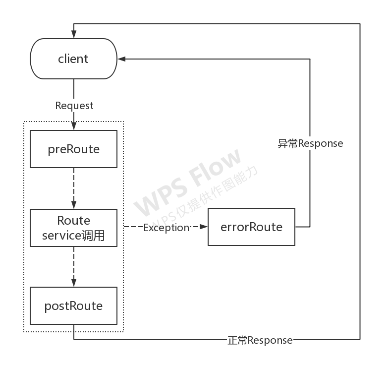

# zuul(二)-过滤器使用
* pre：请求被路由转发前调用
* routing：在路由请求时被调用
* post：在请求路由之后被调用
* error：在处理请求时发生异常被调用

## 过滤器使用场景
* 修改原请求url
* 修改路由的服务id
* 修改原请求体/参数
* 修改响应体/参数
* 鉴权

##### 自定义前置过滤器执行时机需要在zuul自带的pre过滤器之后
```Java
@Override
public String filterType() {
    return FilterConstants.PRE_TYPE;
}

@Override
public int filterOrder() {
    return FilterConstants.PRE_DECORATION_FILTER_ORDER + 1;
}
```

##### 自定义后置过滤器执行时机需要在zuul自带post过滤器之前
```Java
@Override
public String filterType() {
    return FilterConstants.POST_TYPE;
}

@Override
public int filterOrder() {
    // 必须比SEND_RESPONSE_FILTER_ORDER小
    return FilterConstants.SEND_RESPONSE_FILTER_ORDER - 10;
}
```

## 过滤器示意图


## 禁用过滤器
可以采用`zuul.<simpleClassName>.<filterType>.disable=true`的配置方式禁用过滤器。

**simpleClassName：表示过滤器类名。**
**filterType：过滤器类型。**

比如：
```yaml
zuul.ModifyRequestBodyFilter.pre.disable: true
```

